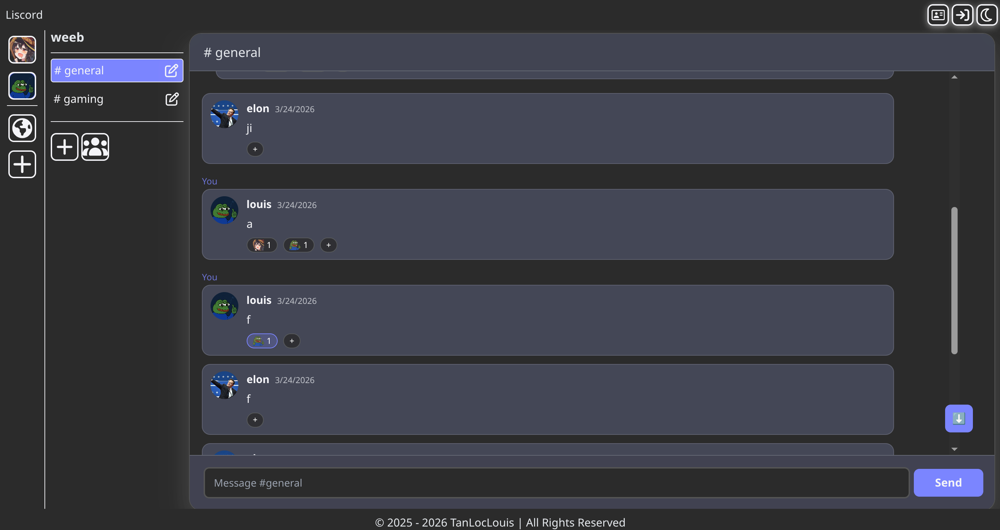

# 📋 Project Overview

This is my pet project offers group chat solution for people, friend, gaming, etc like **Discord**.

# Features Overview
1. What has been done
- Create, manage Server and Channel.
- Real-time chat.
- Push notification on browser.
- Invite people with invite link.
- Create account, manage account.
- React, add custom emoji to server.



---

# 🛠️ Technologies Used
1. Developement
- **Node.js** + **ExpressJS** – Backend server
- **React.js** + **TypeScript** + **Tailwind** – Web frontend
- **MySQL** – Relational data Storage 
- **Scylla** - High performace read/write for message
- **Minio** - Object Storage (banner, avatar)

2. Deployment
- **Docker** – Containerized deployment
- **Redis** *(optional)* – Caching layer for enhanced performance
- **GitHub CI/CD** (optional) – Automated build and deployment pipelines (Not implemented yet :D)

---

# Getting Started

## Quick Setup
- **NodeJS** and **npm**
- **MongoDB** run on local or using **MongoDB Atlat**
- **Docker** if you want to deploy on container

## Frontend

1. Move to frontend folder
```bash
cd frontend
```
2. Install dependencies
```
npm install
```
3. Setup `.env`
- Copy `.env.`test to `.env`
- Edit these field
```bash
VITE_API_URL=http://localhost:3000
VITE_HOST=http://localhost:5173
```
4. Run.
```
npm run dev
```
## Backend
1. Move to backend folder
```bash
cd backend
```
2. Setup `.env` 
- Copy `.env.`test to `.env`
- Edit these field
```bash
SERVER_URL=http://localhost:3000
JWT_ACCESS_TOKEN_SECRET=hihi

# Database configuration
# For MongoDB, use the following format:
MONGO_DB_URL=

# For MySQL, use the following format:
MYSQL_HOST=localhost
MYSQL_PORT=3306
MYSQL_USER=root
MYSQL_PASSWORD=
MYSQL_DATABASE=liscord

# For ScyllaDB, use the following format:
SCYLLA_CONTACT_POINTS=localhost
SCYLLA_PORT=9042
SCYLLA_KEYSPACE=liscord
SCYLLA_USERNAME=
SCYLLA_PASSWORD=

# Using Gmail to send emails
GMAIL_MAIL=
GMAIL_MAIL_TOKEN=

# For AWS S3
AWS_REGION=us-east-1
AWS_S3_BUCKET=liscord
AWS_S3_ENDPOINT=http://localhost:9000
AWS_ACCESS_KEY_ID=admin
AWS_SECRET_ACCESS_KEY=password123
AWS_S3_FORCE_PATH_STYLE=
```
3. Install dependencies
```
npm install
```
4. Run
```
npm run dev
```

## Database
- You need to run these docker containers (in `tools` folder): `minio`, `mysql`, `scylla`
- Each `docker-compose.yaml` file need to set their own vars like `username, password, etc`
1. Run
```
cd minio
docker-compose up -d
```
```
cd mysql
docker-compose up -d
```
```
cd scylla
docker-compose up -d
```
# 🤝 Contributing
I am welcome any contribution! =D  
If you have any questions, please issue me.